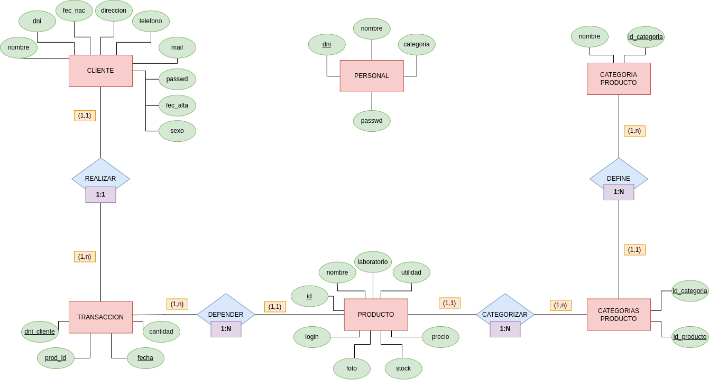

# PharmaSquare Wiki:

## Índice:
- [UI/UX](#uiux)
- [Backend](#backend)
    - [Base de datos](#base-de-datos)
    - [Persistencia](#persistencia) 
    - [Control base de datos](#control-base-de-datos)
- [Excepciones](#Excepciones)
- [Tests unitarios](#tests-unitarios)

## UI/UX:
[Ubicación](../src/main/java/dam/pharmaSquare/view/)

La parte de front end está creada a partir de módulos. Cada módulo representa un menú de la aplicación.
Mediante el uso de un controlador que otorgue la lógica para interactuar con cada uno de estos y con el resto
de módulos de la parte de backend, obtenemos 

## Backend:
Este apartado relata cómo se ha desarrollado toda la lógica que hay por detrás de la aplicación. Si bien es cierto que nuestra aplicación local no tiene un backend como tal, esta seción mostrará cómo se ha desarrollado cada parte para integrarse con la aplicación.

### Base de datos:
[Ubicación](../db/)

La base de datos de nuestro sistema es una base de datos SQL con SQLite3. Esta almacena toda la información necesaria por nuestra aplicación.

Para acceder a esta fuente de datos, hacemos uso de la clase [PharmaSquareDB](../src/main/java/dam/pharmaSquare/db/PharmaSquareDB.java).
Con la ayuda de la lógica lógica común para el manejo de BBDD que tenemos en el paquete [db](../src/main/java/dam/db/),
somos capaces de crear de una manera sencilla toda la lógica entre la aplicación y la base de datos.

#### Detalles uso base de datos:
- La base de datos se vincula con la aplicación mediante el uso de un [archivo.properties](../pharmaSquareDB.properties).
Este tiene todos los detalles necesarios para vincular el archivo SQLite. Es importante destacar que este archivo propone
varias localizaciones donde guardar el archivo para una mayor flexibilidad de desarrollo.
- Todos los métodos que usa la base de datos toma valores que, o ya han sido validados usando [modelos](#modelos) o 
realizando la validación usando la misma lógica que los ya mencionados. De igual manera, todos los datos recopilados de 
la base de datos se transforman en modelos antes de ser enviados a la aplicación.
- Todos los métodos hacen uso de las clases `InvalidDataException` definidas en [excepciones](#Excepciones) para aportar
feedback de qué error ha sido el causante.

### Persistencia:

[Ubicación](../src/main/java/dam/pharmaSquare/model/persistencia/)

Cada clase representa una tabla de la base de datos.

Cada clase contine, además de los atributos de la clase, un atributo con el nombre de la tabla y otro con los atributos que conforman la clave primaria.

### Modelos:

[Ubicación](../src/main/java/dam/pharmaSquare/model/)

Cuando se construye una instancia de una de estas clases, los atributos son verificados. 
Si alguno no cumple las condiciones, se lanzan excepciones con el mensaje de error correspondiente.

Para cada atributo, tienen un método `public static void isXxxValid(Object Xxx)` que lanza excepciones si el dato introducido es inválido. 
Estos están pensados para la verificación anterior y para verificar a priori los formularios.

### Control Base de datos:

[Ubicación](../src/main/java/dam/pharmaSquare/db/)

La lógica de la base de datos está formada por una serie de clases y métodos que simplifican la consulta y modificación de esta de manera que resulte sencillo su implementación en el proyecto.

## Tests unitarios:

[Ubicación](../src/test/java/pharmaSquare/)

A la hora de verificar cada uno de los módulos usados en el código, se ha utilizado tests unitarios JUnit5.
Estos verifican de manera individual cada una de las funcionalidades.

*Nota*: Nos hubiera gustado crear tests automáticos de uso-implementación. Sin embargo, el currículo del curso
no plantea que seamos capaces de realizar este tipo de tests. Por este motivo, toda la parte propia de la
aplicación no contiene tests más de los que ya tienen los módulos que usan.